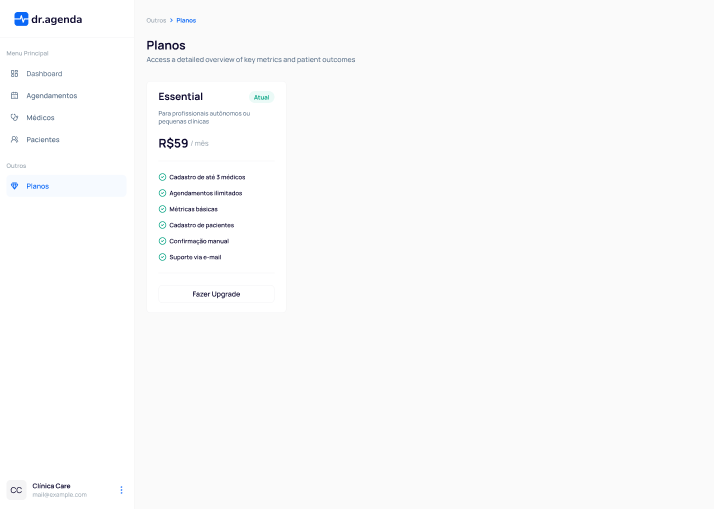
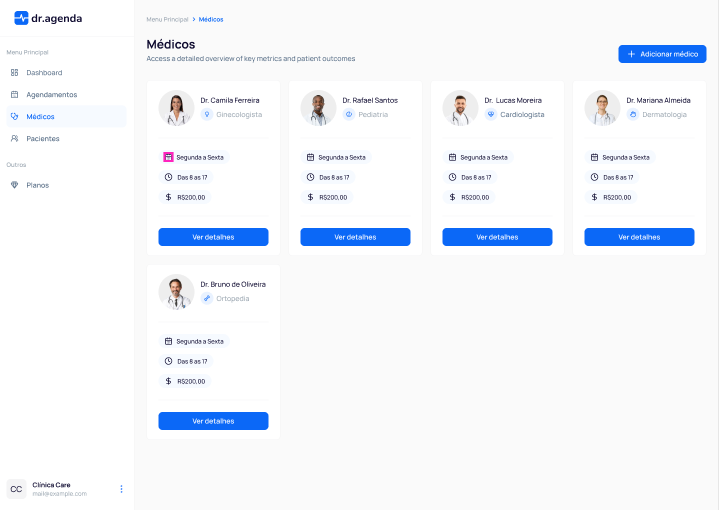
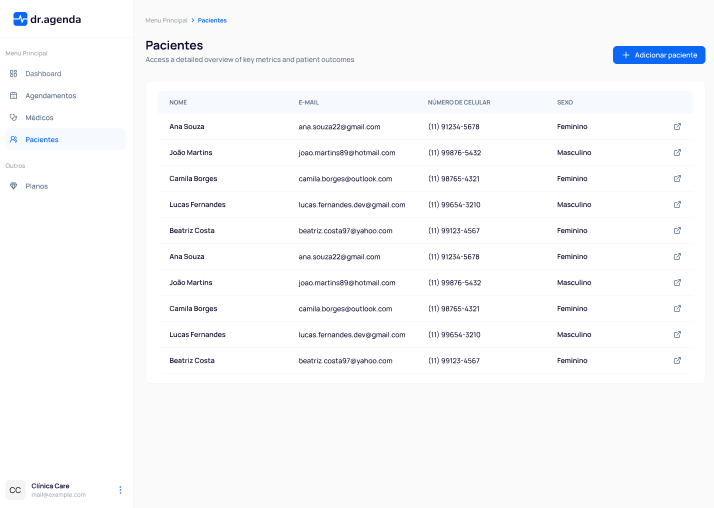
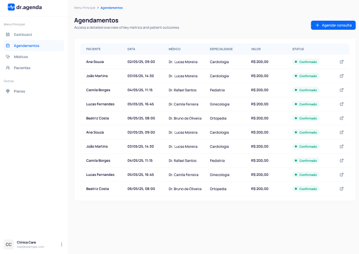
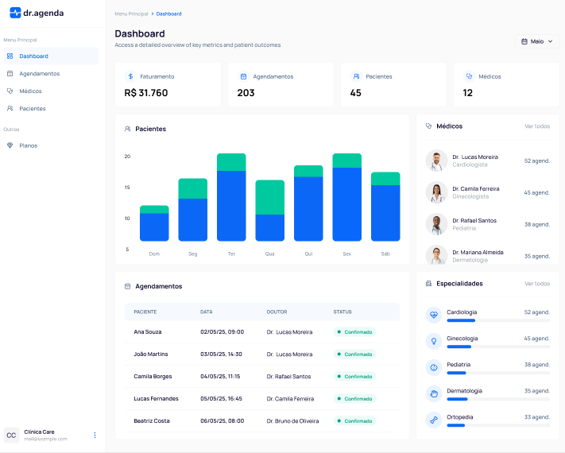

# 🩺 Dr. Agenda — Sistema de Gerenciamento de Clínicas  

🚀 Aplicação moderna para gerenciamento completo de clínicas, profissionais, pacientes e agendamentos. Desenvolvido com Next.js, Drizzle ORM e shadcn/ui.  

---  

## ✨ Funcionalidades  

### ✅ Autenticação  
- Login seguro com e-mail e senha  
- Login social via Google  
- Criação de conta  


### ✅ Gerenciamento de Clínicas  
- Cadastro de clínicas  
- Configuração de informações do estabelecimento  



### ✅ Profissionais de Saúde  
- Cadastro de médicos e profissionais da saúde  
- Edição e atualização de informações  
- Listagem completa de profissionais  
- Exclusão de registros  
- Controle de disponibilidade  



### ✅ Pacientes  
- Cadastro de pacientes  
- Edição de dados cadastrais  
- Listagem de pacientes  
- Exclusão de pacientes  



### ✅ Agendamentos  
- Criação de agendamentos médicos  
- Listagem de agendamentos  
- Cancelamento de agendamentos  



### ✅ Interface moderna e intuitiva  
- Layout responsivo  
- Sidebar com navegação organizada (Route Groups)  
- Componentes reutilizáveis com shadcn/ui  



### ✅ Tecnologias de ponta  
- Next.js com rotas, layouts e server actions  
- Tailwind CSS para estilização rápida e consistente  
- Drizzle ORM para gerenciamento de banco de dados  
- Autenticação moderna com NextAuth  

---  

## 🎨 Link do Figma  
📌 [Protótipo do Design - Dr. Agenda](https://www.figma.com/design/0G9SAhJsDPpb9mXORSxxY3/dr.agenda?node-id=29-588&p=f)  

---  

## 🛠️ Tecnologias e Ferramentas  

- **Next.js** — Framework React full-stack  
- **TypeScript** — Tipagem estática robusta  
- **Tailwind CSS** — Estilização utilitária moderna  
- **shadcn/ui** — Componentes acessíveis e elegantes  
- **Drizzle ORM** — Mapeamento objeto-relacional simplificado  
- **NextAuth** — Autenticação segura  
- **ESLint & Prettier** — Padrões de código  

---  

## 🗺️ Fluxo da Aplicação  

```mermaid
graph TD  
A[Login] --> B[Dashboard da Clínica]  
B --> C[Gerenciar Médicos]  
B --> D[Gerenciar Pacientes]  
B --> E[Gerenciar Agendamentos]  

C --> C1[Adicionar Médico]  
C --> C2[Editar Médico]  
C --> C3[Excluir Médico]  

D --> D1[Adicionar Paciente]  
D --> D2[Editar Paciente]  
D --> D3[Excluir Paciente]  

E --> E1[Criar Agendamento]  
E --> E2[Listar Agendamentos]  
E --> E3[Cancelar Agendamento]  
